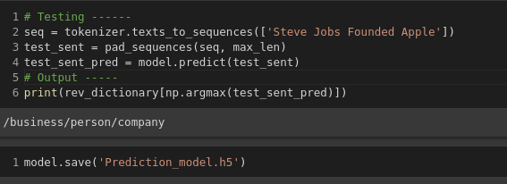

## APPROACHES 

### RULE BASED APPROACH ----
  1. Used Spacy for Defining and Extracting Language Pattern
  2. Used Nyt Dataset for Textual Content and Demonstration purpose

 
### SUPERVISED APPROACH --
  1. Used Nyt Dataset
  2. Used Bidirectional LSTM Model to classify 24 classes.
  3. Saved Model : [LINK](https://drive.google.com/file/d/1o5OC6fXJSxxn0-ii7mrQlvATAOS9gWwK/view?usp=sharing.)

EXPLORING OTHER APPROACHES ALSO AND WILL SHARE IT SOON ...  🤓
